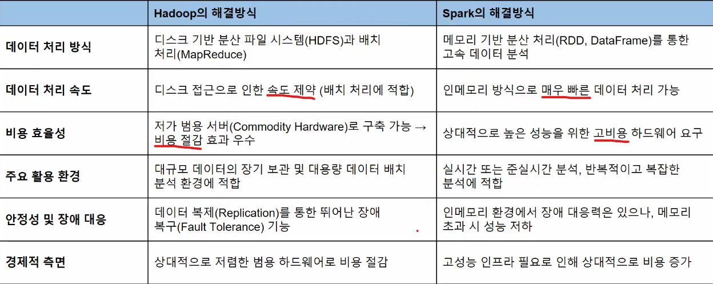
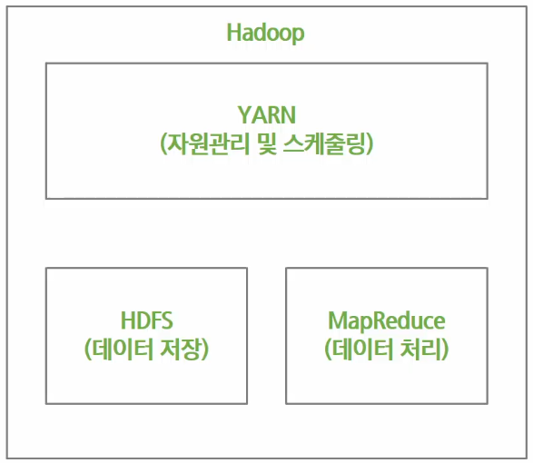
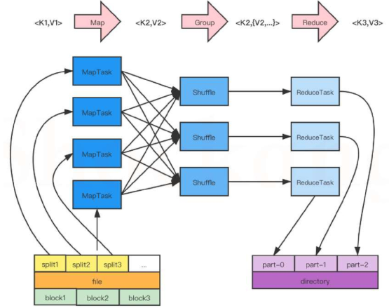

# Hadoop 개요
### Hadoop 등장 배경
- 기존 기술(DBMS, 단일 서버)의 용량, 속도, 확장성의 한계 도달
- 정형 데이터 중심에서 비정형 데이터(이미지. 영상, 텍스트 등) 처리에 대한 요구 증가
- 웹 환경에서 데이터 양적 성장에 따라 신뢰성 높은 저장, 배치 처리 필요성 증대 

### Hadoop
- 대량의 데이터를 안정적으로 처리하기 위해 설계된 오픈소스 기반의 분산 데이터 처리 플랫폼
- 여러 대의 일반적인 컴퓨터를 연결하여 데이터를 분산 저장하고 병렬 처리하는 프레임워크
- 데이터가 많아지고 커질수록 더욱 강력한 성능을 발휘하는 플랫폼으로, 장기간 검증된 기술로서 신뢰성과 안정성 확보 

### Hadoop ecosystem
- 하둡의 코어 프로젝트는 HDFS, MapReduce, YARN이지만 이들의 역할을 수행해내는 다양한 서브 프로젝트들로 구성된 환경 

### Hadoop의 한계
- 실시간 데이터 처리 부적합
  - 데이터 처리가 디스크 기반이므로 속도가 상대적으로 느림
  - 짧은 시간에 반복적이고 실시간 분석이 필요한 환경에는 부적합
- 복잡하고 반복적인 데이터 분석 작업에 한계
  - MapReduce 기반의 반복적 작업은 매번 디스크를 접근해야 하므로 성능 저하
  - 복잡한 데이터 분석이나 반복 분석은 Spark 같은 메모리 기반 기술 추천 

### Hadoop과 Spark

- Hadoop: 장기간 로그 데이터, 고객 정보, 거래 내역 등의 안정적 보관 및 배치 처리 -> 안정적 저정, 장기 보관용
- Spark: 머신러닝, 스트리밍 데이터 처리, 반복적 데이터 분석(예: 사용자 행동 분석, 실시간 추천 시스템 등)에 활용  -> 빠른 처리, 실시간 분석용
- => 함께 사용하면 **완성형 데이터 분석 구조**

# Hadoop의 구성요소
- HDFS (분산 파일 시스템)
  - 데이터를 여러 컴퓨터에 나누어 안정적으로 저장하는 역할
    - 네임노드
      - HDFS 전체에 대한 MetaData 관리 -> 파일 위치, 파일명, 디렉토리 구조 정보 등을 유지 및 관리
      - DataNode의 블록 정보 수신 및 관리 -> 블록 위치를 기록하고 관리하여 클라이언트 요청 시 위치 정보 제공
      - 데이터 복제 관리 
    - 데이터 노드
      - 데이터 분산 저장 
      - 정상 동작 확인(Heartbeat)
      - 블록 리포트 
- MapReduce (분산 데이터 처리)
  - 대규모 데이터를 분산하여 병렬로 처리하는 역할
    - Split -> Map -> Shuffle -> Reduce 

      
      
- YARN (자원 관리 및 작업 스케줄링)
  - Hadoop 클러스터의 자원을 효율적을 관리하고, 작업 스케줄링을 담당 

  

