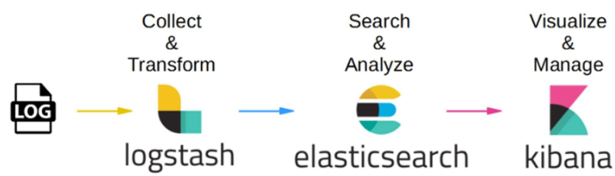

# Kibana 개요
### Kibana 소개
- Elastic Stack
  - 다양한 소스로부터 데이터를 수집하여 검색, 분석 및 시각화할 수 있도록 해주는 도구
- Kibana
  - Elastic Stack의 UI 레이어로, Elasticsearch 데이터를 시각화하고 탐색하는 역할
  - Kibana를 통해 Elastic Stack을 관리할 수도 있음 

### Elastic Stack
- Elasticsearch: 데이터를 저장, 검색, 분석하는 분산형 검색 엔진
- Logstash: 데이터 변환 및 적재 역할을 수행하는 데이터 처리 파이프라인
- Kibana: Elasticsearch 데이터를 분석하고 시각화하는 대시보드 인터페이스 

  

### Kibana Dev Tools
- Dev Tools에서 콘솔을 이용해 Elasticsearch에 직접 REST API 요청을 보낼 수 있음
- Elasticsearch에 보낼 모든 요청을 편하게 수행할 수 있음 

### Kibana의 핵심 기능
- 데이터 추가
  - 앱 또는 서비스에서 데이터 수집, 파일 업로드, 샘플 데이터 추가
  - 파일 업로드: CSV, JSON등의 파일을 Kibana에 업로드하여 사용 가능 
- 데이터 탐색
  - Discover 기능을 활용하여 숨겨진 데이터 관계를 찾아낼 수 있음
- 데이터 시각화
  - 다양한 시각화 기법을 활용하여 데이터를 분석
- 데이터 공유
  - 분석 결과를 시각적으로 표현하고 공유

# 데이터 시각화 및 모니터링 
- 데이터 탐색
  - Discover 기능을 활용하여 숨겨진 데이터 관계를 찾아낼 수 있음
- 데이터 시각화
  - 대시보드를 사용하여 다양한 각도에서 데이터를 시각적으로 표현 
- 데이터 프레젠테이션
  - Canvas 기능을 활용하면 데이터를 시각적으로 매력적 표현 가능
  - 픽셀 단위로 정밀하게 조정하여 표현 가능 